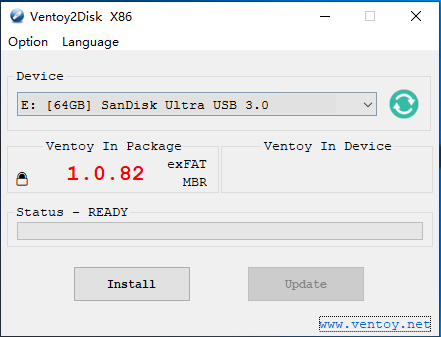
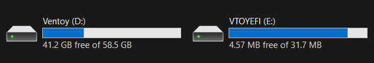

# Installation (Fedora)


Pre-installation Requirements:

* An USB drive with at least 8 GB of storage capacity.
* One of the following tools to create bootable media:\
  &#xNAN;_**Rufus, Ventoy, Balena Etcher, or Fedora Media Writer.**_
*   Secure Boot must be disabled in the BIOS.

    _<mark style="color:orange;">**WARNING:**</mark>**&#x20;****Secure Boot can prevent Fedora from booting if not disabled.**_
*   BitLocker must be turned off.

    _<mark style="color:orange;">**WARNING:**</mark>**&#x20;****Failure to disable BitLocker may result in data loss or drive access issues.**_
* GPU mode should be set to "Ultimate" or "Standard" in Windows before installation.
* Fast Boot should be disabled in Windows. (This is required only if you are planning to dual boot)


## Asus Laptops and Linux Compatibility:

Asus laptops have excellent compatibility with Linux compared to many other brands. Most of the software required to control features such as RGB lighting, CPU modes, and fan curves is readily available on Linux. These functionalities can be managed similarly to how they are on Windows.

For games, you can verify compatibility and anti-cheat support using:

* [Are We Anti-Cheat Yet](https://areweanticheatyet.com)
* [ProtonDB](https://www.protondb.com)

## Installation Steps



## Download the latest Fedora ISO from the official website

https://fedoraproject.org/en/workstation/download

* Recommended: Fedora Workstation (GNOME)
* Alternative: Fedora Workstation (KDE)

<details>

<summary>What do "GNOME" and "KDE" mean?</summary>

These are desktop environments that define the look and feel of your system interface. To know more, [click here to read](https://itsfoss.com/kde-vs-gnome/)

</details>



## Create bootable media



1. Download and run [Rufus](https://rufus.ie/).
2. Select “ISO Image” and then browse for the ISO image.
3. Select the flash drive you want to put the installer on.
4. Select the Partition scheme (GPT/MBR) depending on your motherboard’s capabilities.
5. Click “Start” and wait for it to finish.
6. Eject the USB flash drive.






**Caution**

While Ventoy does support secure boot, there is a chance that it wont work. For this, you will have to refer to their [troubleshooting guide](https://www.ventoy.net/en/doc_secure.html). If you don't want to enroll the MOK keys, simply turn off Secure Boot.



1. Download the .zip of [Ventoy](https://www.ventoy.net/en/download.html) and extract it
2. Run the `Ventoy2Disk.exe` program
3. Select your drive and press `Install`. It should look like this.
<div align="left"><figure><figcaption></figcaption></figure></div>
4. After flash, the right box should have the same numbers as the one in the left.
<div align="left"><figure><figcaption></figcaption></figure></div>
5. Then copy the Windows ISO to the root of VENTOY, not VTOYEFI!
<div align="left"><figure><figcaption></figcaption></figure></div>
6. Restart your computer and boot into Ventoy. If successful, Fedora (and other ISOs you have copied to) should appear here!
<div align="left"><figure><figcaption></figcaption></figure></div>







## Installing Fedora

1. Restart your computer and open BIOS by holding the F2 key &#x20;

In BIOS:

* Disable Secure Boot
* Set the USB drive as the primary boot device by placing it above "Windows Boot Manager".
* Save and exit

Then, boot from the USB drive containing the Fedora image.

2. Wait for the installer to load. Allow 1–2 minutes for the system to load properly. Once loaded, you should see the Anaconda installer.


**Note:**&#x20;

If the installer doesn't appear immediately, wait 10–20 seconds.


3. On the Welcome screen, choose your preferred language and click Next.
4. On the Installation Destination screen, choose how you want Fedora to be installed:
   * **For dual-boot systems:** \
     Ensure that sufficient unallocated space is available on the disk. \
     Select "Share disk with other operating system" and click Continue
   * **For standalone installations:** \
     Choose "Use entire disk".


**Warning:**

At the top of the screen, you’ll see the target drive for installation. If you have multiple drives, make sure to select the correct one to avoid data loss.

**For dual boot systems:**\
Do not create a new volume; leave the space empty for the installer to detect.


5. Configure storage encryption (optional). On the Storage Configuration screen, it's recommended not to encrypt your data for simplicity, unless required.
6. Review and confirm settings. On the Summary screen, review all your selected options. If everything is correct, click Begin Installation.
7. Finish installation and reboot. After the installation completes:
   * Exit the Live Environment.
   * Remove the USB drive.
   * Reboot your system. You should now boot directly into Fedora.



## Uninstalling Fedora

**For dual boot setups**: Follow the [same video guide](https://www.youtube.com/watch?v=eHQJMy8Q7Zk) to remove Fedora safely.

**For standalone Fedora installations:**

1. Boot from Windows installation media.
2. Press `Shift + F10` to open the Command Prompt.
3. Run the following commands:


```batch
diskpart
select disk X (Replace 'X' with the number of the drive where Fedora is installed)
clean
```


4. Continue with the Windows setup normally.


**Note:**

For **Intel systems,** if the Windows installer does not detect your disk, disable VMD (Volume Management Device) in BIOS.

