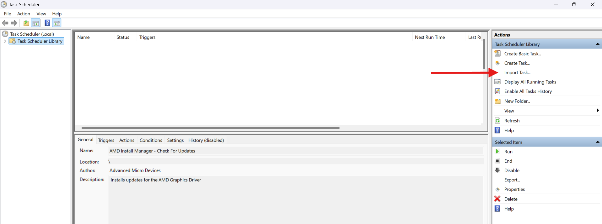

# Battery & Power

Managing your battery effectively helps extend its lifespan and maintain reliable performance.

This section covers optimization settings, best practices, and troubleshooting steps to ensure reliable battery performance and longevity.

## ⚠️ The Essentials



### Enable Smart Charging

Available in MyAsus or G-Helper. ([What is smart charging and how does it help?](https://support.microsoft.com/en-us/windows/use-smart-charging-in-windows-2ac1b4ba-6027-410a-b80e-f6767d867002))

* 80% limit if you mostly use the laptop plugged in but occasionally unplug it.
* 60% limit if it's almost always plugged in.



<figure><figcaption></figcaption></figure>



<figure><figcaption></figcaption></figure>

Enable "**Battery Care Mode**"





### Play games/run demanding applications while plugged in ONLY

Running demanding games or heavy GPU/CPU applications on battery can degrade performance and is not recommended at all.&#x20;

It causes extreme wear due to high power draw and reduces battery lifespan.

_Normal word processing or browsing is fine_



## &#x20;💖 Improving Battery Life



### Switch modes

1. Switch to **Silent fan mode**
2. Switch to **Optimised GPU mode (automatically switches to "Eco" \[iGPU] on battery)**
3. Switch to **"Auto" screen mode (automatically switches to 60Hz on battery)**
4. Keep display brightness **half or less than half**
5. **Disable keyboard backlight** or set it to minimum

That's it!



### Uninstall Asus apps

Uninstall both **MyAsus** & **Armoury Crate.** They run in the background at all times, consuming power even when not in active use, leading to increased battery drain.

This is completely safe and won't hamper your computer, GHelper completely replaces all the processes.&#x20;

Additionally, stop all Asus services via GHelper (Extra > Other > Stop)

<figure><figcaption></figcaption></figure>



### Disable CPU Boost

This helps battery life as it doesn't boost anymore and less power is drawn. There are two ways to do this. Easiest way is via GHelper.


Do not disable if&#x20;

* You play competitive multiplayer games (Valorant/CS)
* Rely on intensive CPU bound applications (Video Editing/Coding/Rendering)

Test and see if you have a significant hit or if it's worth the drop.

Most singleplayer games get very little FPS benefit for a massive thermal increase. (eg: 1/2FPS for 20C inc)




Open 'Fans+Power' and select 'CPU Boost' to 'Disabled'. That's it

<figure><figcaption></figcaption></figure>




1.  Open search and type 'Edit Power Plan' and open.

    
<figure><figcaption></figcaption></figure>

2.  Navigate to 'Change advanced power settings' and then scroll down to 'Processor Power Management'

    
<figure><figcaption></figcaption></figure>

3.  Scroll down again to 'Processor Performance Boost Mode' and select both options to 'Disabled'. That's it

    
<figure><figcaption></figcaption></figure>


Make sure you do this for all performance modes!






### Consider undervolting your CPU/GPU

Undervolting your CPU/GPU reduces power consumption and heat output without sacrificing performance.&#x20;

By lowering voltage while maintaining stability, your system runs more efficiently, leading to extended battery life & lower temperatures.

[Here is a YouTube tutorial on how to undervolt your **GPU**](https://youtu.be/KPR06CxysMw?si=nXEXcK0YHovzhRMY)


Check if your CPU supports undervolting, not all models are supported



BSODs or crashes are normal. Don't worry. If you need additional help or can't figure it out, post on the subreddit or ask in our discord below.

[https://discord.com/invite/g6exUXvWge](https://discord.com/invite/g6exUXvWge)




### Automatically close apps on battery (Advanced)

When you switch to battery, some power hungry apps such as Discord and Nvidia Broadcast may remain open in the background, consuming battery.

This section of the guide shows you how you can automatically exit such apps.\

1. Download the `files.zip` from releases. ([Click here](https://github.com/mrc2rules/CloseAppsOnBattery/releases/tag/v1.0))
2. **Extract the ZIP archive** to any folder
3. Open search and type `Task Scheduler`
4.  On the right-hand panel, click **`Import Task…`** \
    Then select `CloseAppsOnBattery.xml` from the folder you extracted.

    
<figure><figcaption></figcaption></figure>

5.  In the imported task, go to the **`Actions`** tab → Select the listed action → Click **`Edit`**

    
<figure><figcaption></figcaption></figure>

6.  Then, \
    In **`Start in`  -** Paste the directory where you extracted the zip files.

    
<figure><figcaption></figcaption></figure>


**That's it!**

Currently, the script only closes: \
Discord, Steam, EpicGamesLauncher, NvidiaBroadcast\
\
More will be added soon.



If you wish to add apps yourself, open `CloseAppsOnBattery.bat` with Notepad and then add this line under the existing taskkill entries.

`taskkill /IM NAMEOFPROGRAM.exe /F`



