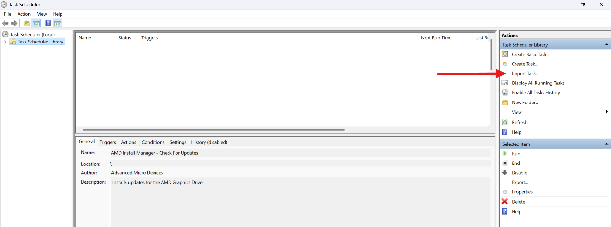

# GPU Performance Optimization

## Introduction

This section covers advanced techniques like **undervolting (UV)** and **overclocking (OC).**&#x20;

<mark style="background-color:blue;">**Under-volting**</mark> <mark style="background-color:blue;"></mark><mark style="background-color:blue;">helps reduce power draw and heat, improving thermal efficiency and battery life. The aim is to</mark> <mark style="background-color:blue;"></mark>_<mark style="background-color:blue;">find the lowest optimal voltage that the GPU can use</mark>_ <mark style="background-color:blue;"></mark><mark style="background-color:blue;">without causing performance losses or instability.</mark>\
\
<mark style="background-color:orange;">**Over-clocking**</mark> <mark style="background-color:orange;"></mark><mark style="background-color:orange;">pushes your GPU above factory clocks for higher performance. This usually increases temps, but mixing it with UV mitigate the effects (more on that later)</mark>


**Note**

Undervolting is also sometimes referred to as "Undervolting + Overclocking" which is what the guide aims to do.

This way you can achieve better thermals and power consumption while maintaining the same performance


New or worried? Click here to read about common misconceptions 

1. _<mark style="color:orange;">**Is overclocking dangerous?**</mark>_\
   \- Modern GPUs limit how far you can push the voltage unless you have a modded VBIOS or have a physical modification to your card. \
   \
   Therefore, your card’s voltage is safe, and increasing clock speeds will not increase the voltage to unsafe values.\

2) _<mark style="color:orange;">**Will undervolting reduce performance?**</mark>_\
   \- In most cases, undervolting actually improves performance if you're power limited (overheating) since it almost always reduces GPU temps and stops the GPU from throttling. Worst case scenario, you just get a cooler GPU.\

3. _<mark style="color:orange;">**What are the best UV/OC settings for my GPU?**</mark>_\
   \- There is no best overclock or undervolt settings. \
   \
   Every GPU is different physically and will UV/OC differently, so copying settings is not advisable. It all depends on silicon lottery and you need to test it yourself

## <mark style="color:red;">Prerequisites ⚠️</mark>

1. **Overclocking Software**

* [MSI Afterburner](https://www.msi.com/Landing/afterburner/graphics-cards)\

2. **Monitoring Software**

* [HWiNFO](https://www.hwinfo.com/download/) -- It displays the values of all sensors available.
* [GPU-Z](https://www.techpowerup.com/download/techpowerup-gpu-z/) -- It reports hardware specifics of your GPU.\

3. **Benchmarks**\
   In order to test our UV, we need to stress test to make sure the values are stable. Instability is when you have _artifacts, freezes, crashes, major stutters, or shutdowns._\

* One of the best ways to stress-test a GPU is to just run some games (eg:- Cyberpunk 2077)
* [Superposition](https://benchmark.unigine.com/superposition) -- Dedicated benchmarking software. Make sure to set the preset so it maxes out the VRAM _without going over._ \
  \
  It's also has pretty reliable scores if you want to graph/see performance regressions.&#x20;

## <mark style="color:blue;">Undervolting ⚡</mark>

* **Before proceeding, ensure you have installed everything from** [#prerequisites](gpu-performance-optimization.md#prerequisites "mention")
* For demonstration purposes, we are going to be using an example 4060M GPU. Your GPU settings and UV **WILL VARY.**
* You can click the images to get a zoomed view

## Steps



Run a game or the superposition benchmark software.\
\
Then, open GPU-Z and head to the `Sensors` tab. \
Note your `GPU Clock` and`GPU Voltage` values (should be ≥ \~0.975v).\
\
Keep note of the `GPU Temperature`\
&#x20;



Open MSI Afterburner. Inside, do `CTRL + F` to open the curve editor. \
The bottom horizontal line is your **voltage.**\
The vertical line to your left is your **clock speed.**\
\
It should look like this:

<figure><figcaption></figcaption></figure>




Remembering your max `GPU Voltage`, click the dot directly above it. \
These are your stock values. (_In my case_, 1.01v & \~2500Mhz as highlighted in white)&#x20;

<figure><figcaption></figcaption></figure>




Next, go down by 25mv and click that point. (_In my case,_ that would be 0.975v )

<figure><figcaption></figcaption></figure>



Then, **hold shift + drag the point** **upwards** till the highlighted `GPU Clock` value on the left reaches your stock clocks from before. (_In my case,_ I dragged it from 2400MHz to 2500Mhz)

<figure><figcaption></figcaption></figure>



Next, again, **hold shift, select the entire region to the right of your value** _(0.975v in my case)_ **and drag it fully down.**\

<figure><figcaption></figcaption></figure>

It should look like this:\

<figure><figcaption></figcaption></figure>



Run the **SuperposItion Benchmark** to test your settings.&#x20;


BSODs or crashes are normal. Don't worry. If you need additional help or can't figure it out, post on the subreddit or ask in our discord below.

[https://discord.com/invite/g6exUXvWge](https://discord.com/invite/g6exUXvWge)


\
If you do not experience crashes or artifacts, repeat Steps 4 till 8 again.\
If you hit an unstable voltage, keep increasing the voltage by 5mv until you have stable results again.\
\
(_Suppose,_ 0.975v is unstable for you. Increase it by 5mv - 0.980v - and test again. If it's still unstable, keep going until you have stable results).\




Finally, after you've determined your stable settings,\
apply the settings  and save  them to a profile. &#x20;



Click this  to have the your settings applied at startup.




Congratulations! You should now have a lower temperature while maintaining the same performance! Compare your `GPU Temperature` from Step 1 vs now!

